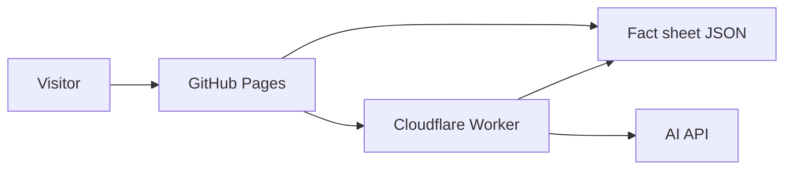

# System design and user guide

## Purpose and users

Players browse game facts and ask questions with traceable sources. Sean maintains the reviewed facts and media. The site is an independent fan project.

## Components

GitHub Pages hosts HTML, CSS, JavaScript, JSON, and uploaded media. The browser searches facts locally and shows direct matches if the API is unconfigured or unavailable. When configured, the Worker performs its own retrieval and sends matching records to the AI API. The API key is stored as a Worker secret. The Worker refuses requests from other browser origins, although origin checks alone are not a complete abuse control.

## Data design

`facts.json` is a read-only collection. Each entry has `id` (unique string), `category` (filter group), `title` (display title), `fact` (short reviewed claim), `keywords` (search terms), and `source` (absolute URL). `gallery.json` holds a local image filename and caption for each gallery slot. Neither visitor questions nor personal data are saved by the application code.

## User flows

1. **Browse:** choose a category or enter search text. Relevant cards and source links appear.
2. **Ask:** type a question or select a sample. Direct retrieval identifies candidate facts. The configured Worker may return generated wording and source links; otherwise reviewed facts are displayed. An unmatched question yields an explicit no-answer message.
3. **Media:** browse the gallery and press Play or Pause. Audio repeats while the tab stays open. The browser will not autoplay audible music before interaction.

## Functional requirements

- Load and display fact entries and filter by category and text.
- Answer supported questions from the fact file with source links; decline unmatched questions.
- Route AI requests through the Worker with the provider key inaccessible to browsers.
- Keep direct retrieval usable when the Worker is absent or unavailable.
- Display authorized screenshots and provide looping music controls.

## Nonfunctional requirements

- Responsive layout for narrow and wide viewports; keyboard operable controls and readable labels.
- No client-side API secret. Limit question length and response output size.
- Static browsing stays usable without the AI endpoint.
- Avoid storing visitor questions in application code. Hosting and AI providers may process requests under their own policies.

## Manual test checklist

| Test | Expected result |
| --- | --- |
| Search `animal` | Animal Orb facts appear. |
| Filter `Characters` | Only character entries appear. |
| Ask `How many players can play?` | Up to four players, with official source. |
| Ask `What is Insane Mode?` | Campaign challenge, with official source. |
| Ask unrelated question | Explicit no-answer response. |
| API unavailable | Direct facts appear, no broken page. |
| Invalid image path | Visible placeholder; rest of page usable. |
| Audio file supplied, click Play then Pause | Music starts, loops, and pauses. |
| Narrow screen and keyboard navigation | Cards stack, inputs remain usable. |

## Known limitations

Keyword retrieval can miss synonyms or select a related record that does not fully answer a nuanced question. AI wording can be inaccurate even when relevant source entries are supplied; compare answers with the linked sources. JSON requires Git commits to update and the Worker must be redeployed after fact changes. Media files are intentionally absent until permission and uploads are available. Worker deployment and the provider key are needed to activate AI answers. Large-scale public traffic needs rate limiting and spending controls.
